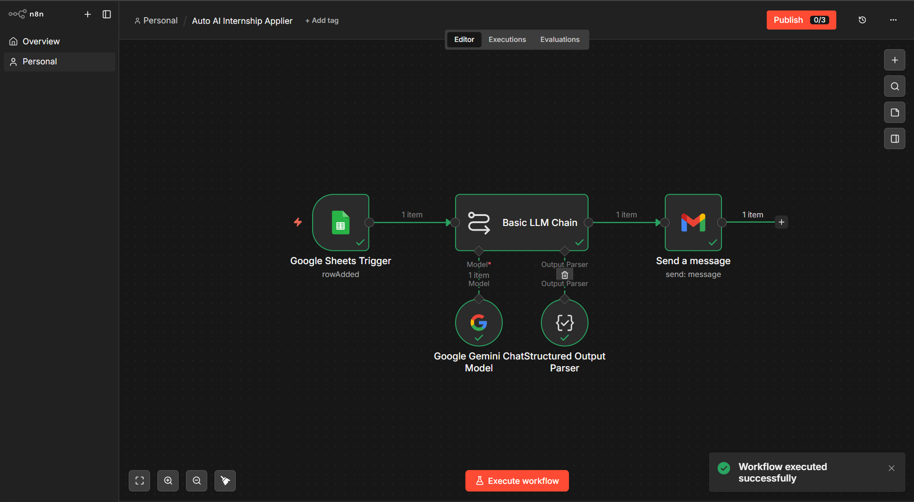
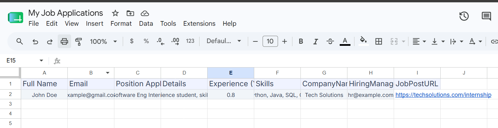
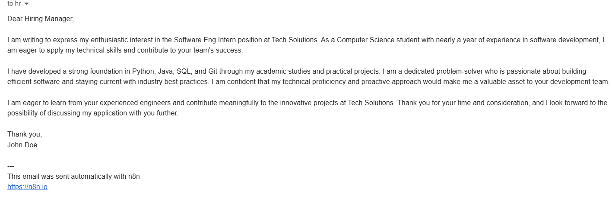

# 🚀 Auto AI Internship Applier

An AI-powered automation workflow built with **n8n**, **Google Gemini AI**, **Google Sheets**, and **Gmail** that automatically generates and sends personalized internship application emails.

## ✨ Features

- 📄 Detects new rows added to Google Sheets
- 🤖 Generates personalized internship emails using Google Gemini AI
- 📧 Sends emails automatically through Gmail
- ⚡ Fully automated n8n workflow
- 🎯 No-code / Low-code automation

---

## 🛠 Tech Stack

- n8n
- Google Gemini AI
- Google Sheets API
- Gmail API
- Prompt Engineering

---

## 🔄 Workflow

Google Sheets
⬇
Google Sheets Trigger
⬇
Gemini AI
⬇
Structured Output Parser
⬇
Gmail

---

## 📂 Repository

```
workflow.json
README.md
```

---

## 🚀 Future Improvements

- Resume attachment support
- LinkedIn job search integration
- AI-powered cover letter generation
- Multi-provider LLM support
- Automatic follow-up emails

---

## 📸 Project Preview

### n8n Workflow


### Google Sheets


### Generated Email



## ⚙️ How It Works

1. A new row is added to Google Sheets.
2. The Google Sheets Trigger starts the workflow.
3. Google Gemini AI generates a personalized internship application email.
4. A Structured Output Parser formats the AI response.
5. Gmail automatically sends the email to the recruiter.


## 🚀 Setup

1. Import `workflow.json` into n8n.
2. Connect your Google Sheets account.
3. Connect your Google Gemini API credentials.
4. Connect your Gmail account.
5. Replace the placeholder Google Sheet ID with your own.
6. Activate the workflow.


## ⭐ If you found this project useful

Give it a ⭐ on GitHub!


